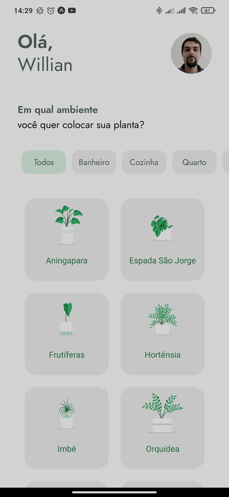

# PlantManager

- PlantManager is a mobile application for taking care of your home plants.

- This app was done on the NWL (Next Week Level) of React Native, starting 19 April, 2021.

- Powered by React Native (and Rocket Seat, of course).

## Util information:
> To install icons at expo: `$ expo install @expo/vector-icons`

> To install the font, use `$ expo install @expo-google-fonts/jost`
  It is also required to import it on the **App.js** file

> Routing between pages: `$ npm install @react-navigation/native`
  For running a Expo project, also install: `$ expo install react-native-gesture-handler react-native-reanimated react-native-screens react-native-safe-area-context @react-native-community/masked-view`
  Also, install `$ npm install @react-navigation/stack`

> For iPhone X better layout, install the *react native iphone X helper*, with `npm i react-native-iphone-x-helper --save`

> For dealing with server requests, install Axios: `$ npm install axios` 
  Also, install *json-server* (globally), for fake requests: `$ npm install json-server`

> For dealing with *.svg*, install the package *react-native-svg*: `$ expo install react-native-svg`

> Animations `$ expo install lottie-react-native`

> For using the `$ expo install @react-native-async-storage/async-storage`

> Timepicker: `expo install @react-native-community/datetimepicker`
  Also, install `npm install date-fns --save`

> To install the bottom-tabs: `npm install @react-navigation/bottom-tabs`

> Notifications API: `$ expo install notifications`

## API

> To simulate a API, use `$ json-server src/services/server.json --host {host} --port {port}`, in which *host* is the address of your computer (like 10.0.0.102) and *port* is the port selected (3333, in this case).
Run the json-server from terminal to receive the requests from `server.json` file.

## Screenshot

